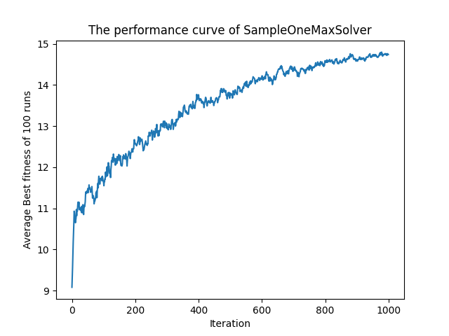
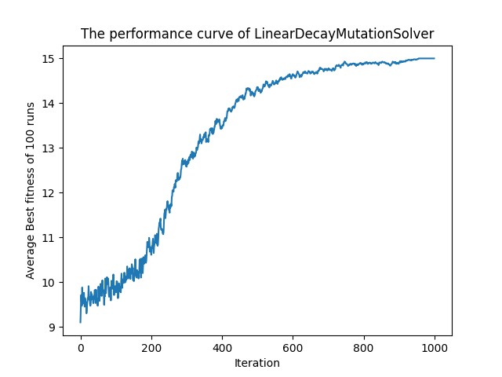
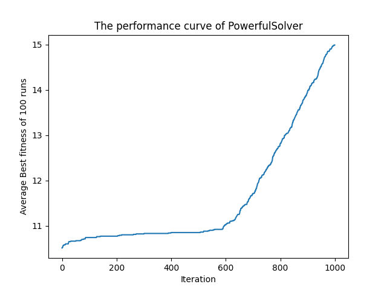
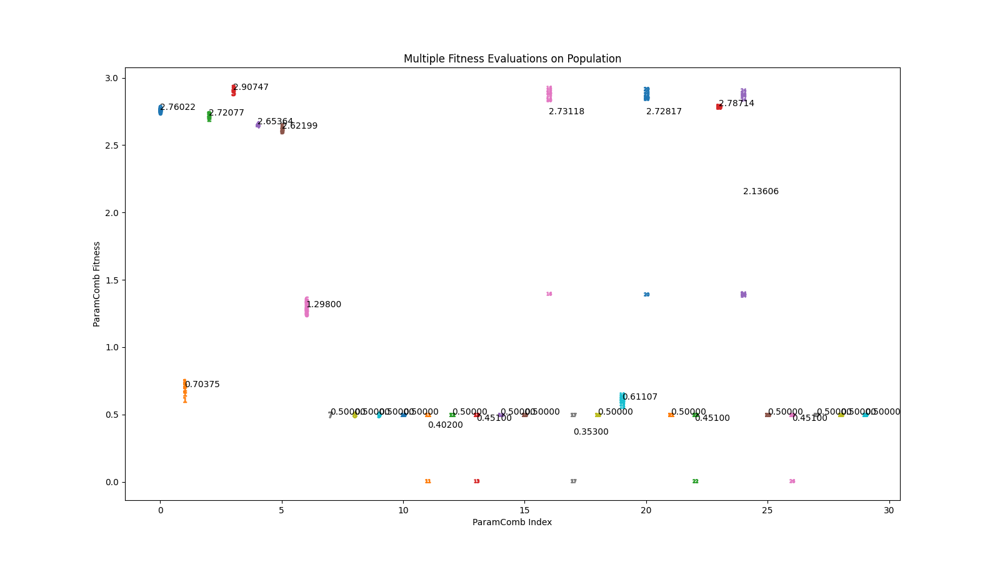

# NIC2022_TeamM

## Team members (Names in alphabetical order):
- Brian Pereira
- Duanyu Lee
- Jinming Wang
- Shujing Sun
- Tianyu Gong

## Problem: Worst 1-max solver (GECCO 2007)
- Introdution URL: https://www.sigevo.org/gecco-2007/competitions.html#c2
- One-Max problem: Find the maximum sum of a length N bit string (a string consisting of only 1s and 0s)
- Conatraints
    1. Algorithm should solve the problem with above 95% chance (find the optimal bitstring 95 times out of 100 runs)
    2. Solve the problem as late as possible, within 1000 generations (for example, solves the problem in 100 generation is not good, solves it in 700 generations is good)
    3. At most 10,0000 fitness evaluations can be made.
    4. Parameters can change during EA running, but only linearly.

## How to Run
- OneMaxObject.py
  - When you run it, it does some testing to Population and Bitstring
- SampleOneMaxSolver.py
  - When you run it, it runs SampleOneMaxSolver once
  - You can call experiment function, this will run SampleOneMaxSolver 100 times with given parameters, print and plot the results.
- LinearDecayMutationSolver.py
  - When you run it, it runs LinearDecayMutationSolver once
  - Uncomment the function call to experiment will run the algorithm 100 times, then print and plot results
  - Call paramSearch1 and paramSearch2 function will run a searching and evaluation to different parameter combinations
  - Change file path inside findBestInRecord and call it will run an analysis on output of paramSearch, given top-k best parameter combinations
- PowerfulSolver.py
  - placeholder
- EAofEA/EAEA.py
  - When you run it with some given parameters, it will give start searching for parameter combinations for PowerfulSolver, and produce plot
  - You can load from a saved checkpoint file and continue to run
  - You can load from a saved checkpoint file and do multi-trial evaluation on each element of the current population

## Meeting time
- 2022 Nov 06 around 15:00 to 16:00
- 2022 Dec 10 after 15:00
- 2022 Dec 11 after 14:30

## Progress
### SimpleOneMaxSolver
This solver is too powerful, the problem solve rate is 97%, solves the problem within 240 - 300 generations. It it because it learns too fast at the beginning, but this is the simplest design.
***

### LinearDecayMutationSolver
This solver uses a decaying mutation rate, at the beginning, the mutation rate is big, the EA is very inefficient, it explores too much to converge. As the generation number increases, the mutation decreases and start to make sense. The decaying of learning rate, exploring rate or mutation rate is a very common technique in machine learning. Here, it is used to make the EA unefficient at the beginning and efficient at the end, so the optimal bitstring is found at later generations. The problem solve rate can reach 730 to 770, and the problem solve ratee is 98%
***

### PowerfulSolver
In previous solver, we learnt that we can actually make the EA almost do nothing by using insane parameters at the beginning, and the EA starts to search for correct results when parameters decreases to valid range. The point is that, if the EA searches too slow with good parameters, then we have to reserve enough generations for it to converge and find the optimal answer, if the EA is very powerful, then we can reserve fewer generations for it to find the optimal answer. In an extreme and ideal way, if the EA can find the best bitstring in single generation, then in the first 999 generations it is allowed to do nothing. So, in the end, we still need a strong EA.
***

### EA of EA
When the design of EA gets complicated, it is difficult to find a set of good parameters, since parameters can have complex interactions, causing different effects to exploration and exploitation. It is an idea to use EA to find the parameters of another EA. Many EA with different parameters forms a population, operations like crossover, tournament selection, mutation are allowed to make child EA with new and better parameters. Fitness function is defined according to the problem objectives. For the final resulting population, every single EA is evaluated 10 times (it means try to solve problem 1000 times), the one with highest average fitness is selected as the final answer, index 3 in the plot below have a problem solve rate of 98.4% and solves the problem at 930 generation on average.
***

