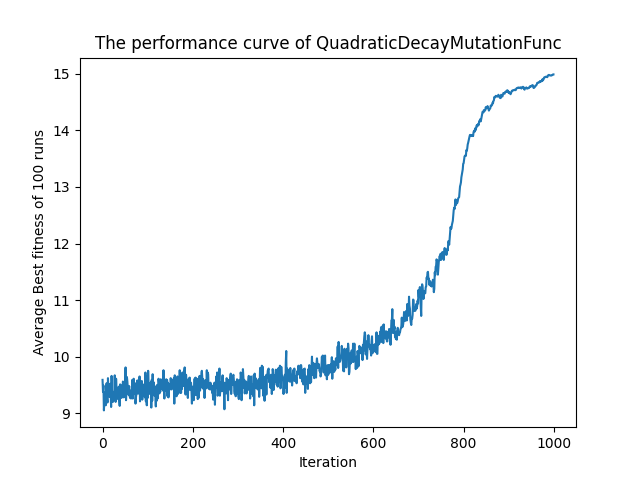

# NIC2022_TeamM

## Team members (Names in alphabetical order):
- Brian Pereira
- Duanyu Lee
- Jinming Wang
- Shujing Sun
- Tianyu Gong

## Problem: Worst 1-max solver (GECCO 2007)
- Introdution URL: https://www.sigevo.org/gecco-2007/competitions.html#c2
- One-Max problem: Find the maximum sum of a length N bit string (a string consisting of only 1s and 0s)
- Conatraints
    1. Algorithm should solve them problem with above 95% chance (find the actually maximum sum 95 time out of 100 runs)
    2. Solve the problem as late as possible, with 1000 generations

## Meeting time
- 2022 Nov 06 around 15:00 to 16:00

## Progress
### SimpleOneMaxSolver
This solver is too powerful, the problem solve rate is 97%, solves the problem within 240 - 300 generations. It it because it learns too fast at the beginning, but this is the simplest design.
***

### LinearDecayMutationSolver
This solver uses a decaying mutation rate, at the beginning, the mutation rate is big, the EA is very inefficient, it explores too much to converge. As the generation number increases, the mutation decreases and start to make sense. The decaying of learning rate, exploring rate or mutation rate is a very common technique in machine learning. Here, it is used to make the EA unefficient at the beginning and efficient at the end, so the optimal bitstring is found at later generations. The problem solve rate can reach 730 to 770, and the problem solve ratee is 98%
***

### QuadraticDecayMutationSolver
This solver pushes the efficient searching to even later generations, it makes the beginning event more unefficient, by using a quadratic function as mutation rate decay function. This should be better than LinearDecayMutationSolver, but extremely difficult to find a good set of parameters.
***

### EA of EA
When the design of EA gets complecated, it is difficult to find a set of good parameters, since parameters can have complex interactions, causing different effects to exploration and exploitation. It is an idea to use EA to find the parameters of another EA. Many EA with different parameters forms a population, operations like crossover, tournament selection, mutation are allowed to make child EA with new and better parameters. Fitness function is defined according to the problem objectives. For the final resulting population, every single EA is evaluated 10 times (it means try to solve problem 1000 times), the one with highest average fitness is selected as the final answer, index 19 in the plot below have a problem solve rate of 99% and solves the problem at 807 generation on average.
***

